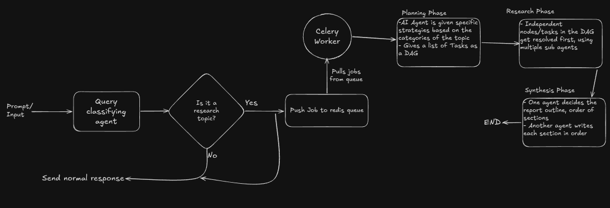

# Multi-Agent Research System

A multi-agent system designed to automate deep research and generate comprehensive structured reports based on user queries. The system classifies, decomposes, executes, and synthesizes research in a parallel, distributed workflow.

## Pipeline Architecture

The research pipeline consists of three main phases:

1. **Planning Phase**:
   - Classifies the incoming research query to understand its intent(greeting or a question or an actual research topic) and categorize the subject.
   - Deconstructs the research goal into a structured plan consisting of multiple granular research tasks, which are saved to the database.

2. **Research Phase**:
   - Execute the generated research tasks. Each task is run concurrently, utilizing tools like web search (Tavily) and extract, crawlpage to collect relevant data.
   - Progress, task statuses, and intermediate results are saved to Postgres and published via a Redis channel to provide live WebSocket streaming to the client.

3. **Synthesis Phase**:
   - Analyzes the collected research findings and designs a comprehensive report outline.
   - Generates detailed content for each section based on the research data.
   - The final report is compiled, stored in the database, and sent to the client.

---



---

## Project Setup

### 1. Prerequisites

- **Docker** & **Docker Compose**
- **uv** (fast Python package installer and resolver)

### 2. Database & Redis Containers

```bash
# Run PostgreSQL
docker run -d \
  --name postgres \
  -p 5432:5432 \
  -e POSTGRES_USER=postgres \
  -e POSTGRES_PASSWORD=password \
  -e POSTGRES_DB=postgres \
  postgres:alpine

# Run Redis
docker run -d \
  --name redis \
  -p 6379:6379 \
  redis:alpine
```

### 3. Environment Configuration

Copy the sample .env and configure your API keys:

```bash
cp .env.example .env
```

### 4. Python Environment & Dependency Installation

Use `uv` to sync and install the dependencies:

```bash
# Synchronize environment and install dependencies
uv sync
```

### 5. Run Database Migrations

Apply Alembic migrations to set up the PostgreSQL database schema:

```bash
uv run alembic upgrade head
```

---

## Running the Services

### Start the Backend API Server

Run the FastAPI application with Uvicorn:

```bash
uv run uvicorn backend.main:app --reload --port 8000
```

### Start the Celery Worker

Run the background research pipeline tasks in a different terminal using Celery:

```bash
uv run celery -A backend.celery_app worker --loglevel=info
```

---

## Frontend Setup

### Prerequisites

- **Node.js** (v18+)
- **npm** or **yarn**

### 1. Navigate to the Frontend Directory

```bash
cd frontend
```

### 2. Install Dependencies

```bash
npm install
```

### 3. Environment Configuration

```bash
cp .env.example .env
```

Configure the following in `.env`:

```env
VITE_API_URL=http://localhost:8000
VITE_WS_URL=ws://localhost:8000
```

### 4. Start the Development Server

```bash
npm run dev
```

The app will be available at `http://localhost:5173`.

---

## Supabase Setup

### 1. Create a Supabase Project

Go to [supabase.com](https://supabase.com) and create a new project.

### 2. Create a Storage Bucket

1. Navigate to **Storage** in the Supabase dashboard.
2. Click **New Bucket**, name it (e.g. `diagrams_bucket`).
3. Keep the bucket **private** — the backend accesses it via the service role key, and the frontend receives short-lived signed URLs.

### 3. Configure Bucket Policies

Under **Storage → Policies**, add the following policy to allow the backend service role full access:

```sql
-- Allow service role to upload, read, and delete
CREATE POLICY "Service role full access"
ON storage.objects
FOR ALL
TO service_role
USING (bucket_id = 'diagrams_bucket')
WITH CHECK (bucket_id = 'diagrams_bucket');
```

Authenticated users do not need direct bucket access — signed URLs handle reads.

### 4. Add Supabase Credentials to `.env`

```env
SUPABASE_URL=https://your-project.supabase.co
SUPABASE_SERVICE_KEY=your-service-role-key
SUPABASE_DIAGRAM_BUCKET=diagrams_bucket
```

Use the **service role key** (not the anon key) in the backend — it bypasses RLS and is required for uploads. Never expose this key to the frontend.
---

## Features to add (V2 Checklist)

- [x] Migrate `agents_service` to **LangChain/LangGraph**
- [x] Stream agent responses/events to frontend
- [x] Implement **chat history / conversation memory**
- [x] Sandboxed code execution for charts/data analysis
- [x] Agent-generated diagrams
- [ ] Add caching
- [ ] Add rate limiting

## V3 Checklist

### LLM / Agent workflow

- [ ] Add **research replanning** when evidence is insufficient
- [ ] Implement conditional routing / adaptive research
- [ ] Add **human-in-the-loop** interruption/resume

### Research quality

- [ ] Add contradiction detection
- [ ] Build **claim + evidence + source** model
- [ ] Add claim-level **citation/provenance**

### Infrastructure

- [ ] Add durable execution / **checkpointing**
- [ ] Add retries + failure recovery
- [ ] Add distributed tracing / observability
- [ ] Add LLM **model routing**
- [ ] Serve images through your our backend, instead of cdn link in md

### Evaluation

- [ ] Create research evaluation dataset
- [ ] Combine grader types.
- [ ] Groundedness checks verify that claims are supported by retrieved sources.
- [ ] Coverage checks define key facts a good answer must include.
- [ ] Source quality checks confirm the consulted sources are authoritative, rather than simply the first retrieved

* [ ] Build a llm based rubric.

- [ ] Track latency + cost per run

### Advanced

- [ ] Editable reports → targeted re-research
- [ ] Research artifacts/versioning
